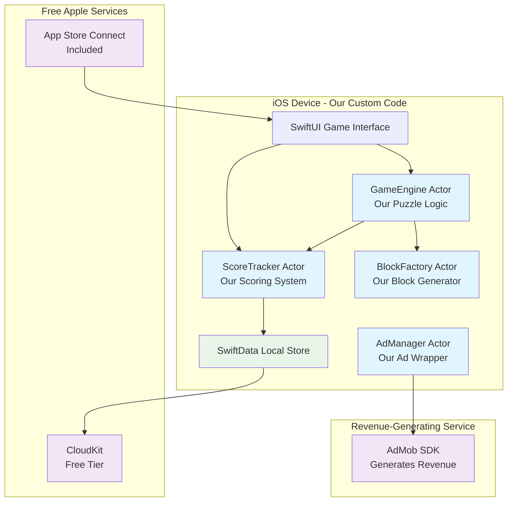
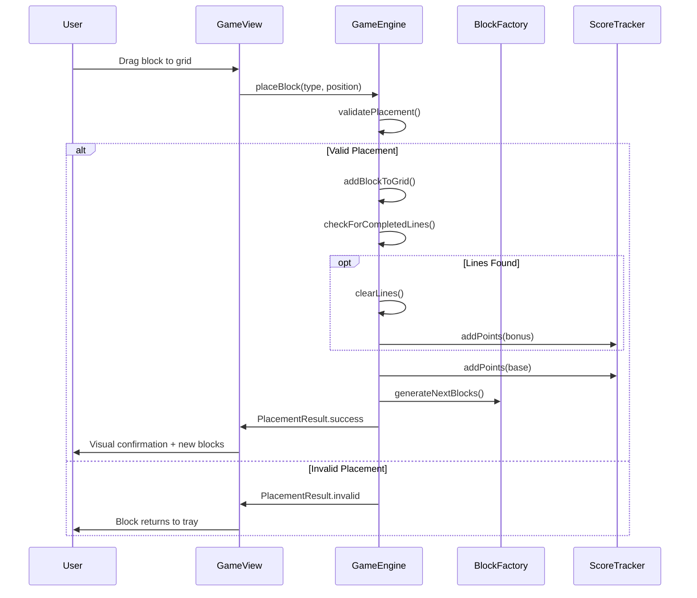
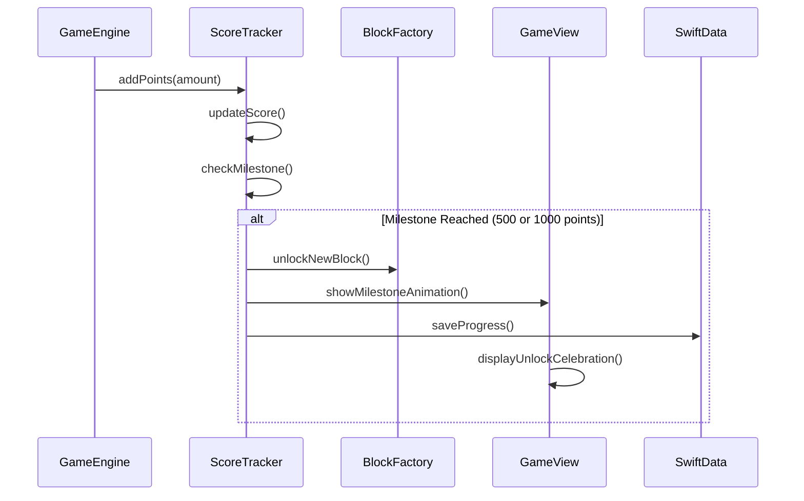
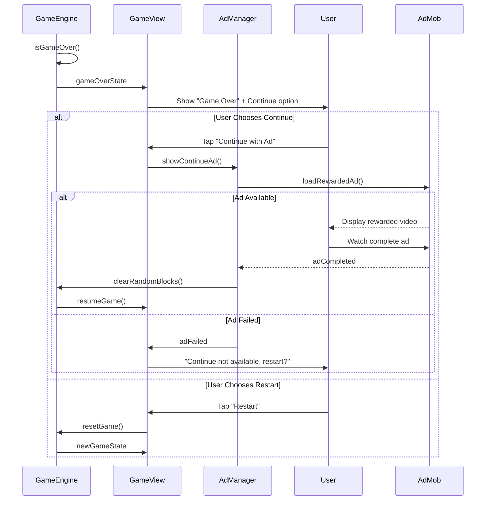

# Block Puzzle Pro Fullstack Architecture Document

## Introduction

This document outlines the complete system architecture for **Block Puzzle Pro**, a premium iOS puzzle game featuring progressive block unlocks, customizable timer modes, and player-controlled monetization. The architecture encompasses the entire technical stack from Swift 6.1 + SpriteKit game engine through SwiftData persistence, CloudKit sync, and AdMob integration.

This unified approach ensures consistency across all system components while maintaining the rapid development timeline (6-8 week solo development) and premium user experience requirements (60fps performance, <2s launch times, 40% Day 1 retention targets).

The architecture is specifically designed for AI-driven development, providing clear patterns and constraints that enable efficient code generation while maintaining architectural integrity throughout the development process.

### Starter Template or Existing Project

**Status:** ✅ **Native iOS Project - Swift + SpriteKit Foundation**

After reviewing the PRD, this is a **greenfield iOS mobile game project** using Apple's native development stack:

- **Platform:** Native iOS (Swift 6.1 + SpriteKit)
- **Architecture Pattern:** Actor-based monolith with component separation  
- **Target:** Single iOS app with integrated backend services (CloudKit, AdMob)
- **Constraints:** Portrait-only orientation, offline-first with cloud sync

**Key Architectural Decisions Already Made:**
- Swift 6.1 for enhanced concurrency safety and performance
- SpriteKit for 60fps game rendering and smooth animations  
- SwiftData for local persistence with automatic CloudKit integration
- Actor-based architecture (GameEngine, ScoreTracker, BlockFactory, AdManager)
- iOS 17+ minimum support for 95% device coverage

This is **not a traditional web fullstack** application but rather a **comprehensive mobile system** that includes client-side game logic, local data persistence, cloud synchronization, and third-party service integrations.

### Change Log

| Date | Version | Description | Author |
|------|---------|-------------|---------|
| 2025-09-12 | 1.0 | Initial architecture document creation | Winston (Architect) |

## High Level Architecture

### Technical Summary

Block Puzzle Pro implements a **Native iOS Actor-Based Architecture** deployed as a single app package with integrated cloud services. The system leverages Swift 6.1's enhanced concurrency model to separate game logic into **custom Swift actors we'll develop ourselves** - no external engines or paid services required.

**What These Actors Actually Are (Custom Swift Code):**
- **GameEngine Actor**: Our custom puzzle game logic (grid management, block placement, line clearing)
- **ScoreTracker Actor**: Our custom scoring system (points calculation, milestone tracking, high scores)
- **BlockFactory Actor**: Our custom block generation system (creates L-shapes, squares, etc.)
- **AdManager Actor**: Our custom wrapper around AdMob SDK (handles ad requests, not a paid service)

All actors communicate through Swift's structured concurrency patterns. The architecture achieves PRD performance goals through SpriteKit's optimized rendering pipeline, SwiftData's efficient local persistence with automatic CloudKit synchronization, and strategic AdMob integration that maintains 60fps gameplay while delivering targeted $10K monthly revenue through player-controlled rewarded video ads.

### Platform and Infrastructure Choice

Based on the PRD requirements for rapid solo development and premium iOS gaming experience, I'm recommending the **Apple Native Ecosystem** approach:

**Option 1: Apple Native Ecosystem (RECOMMENDED)**
- **Pros:** Optimal performance, seamless device integration, mature tooling, single developer efficiency
- **Cons:** iOS-only, requires Apple Developer Program, App Store dependency
- **Services:** CloudKit (free with limits), AdMob (revenue generating), App Store Connect (included)

**Option 2: Cross-Platform Game Engine (React Native + Expo)**  
- **Pros:** Potential Android expansion, web deployment options
- **Cons:** Performance limitations for 60fps gaming, complex native module integration
- **Services:** Firebase, AdMob, Expo Application Services

**Option 3: Unity Cross-Platform**
- **Pros:** Professional game engine, multi-platform deployment
- **Cons:** Overkill for 2D puzzle game, steeper learning curve, larger app size
- **Services:** Unity Cloud, Unity Ads, platform-specific stores

**RECOMMENDATION: Apple Native Ecosystem**

**Platform:** iOS Native (Swift 6.1 + SpriteKit)
**Key Services:** CloudKit (free tier), AdMob (generates revenue), App Store Connect (distribution), TestFlight (beta testing)
**Deployment Host and Regions:** App Store Global Distribution, CloudKit automatically handles regional data centers

### Repository Structure

**Structure:** Single iOS Xcode Project (Monolith)
**Monorepo Tool:** N/A - Swift Package Manager for dependency management
**Package Organization:** Actor-based logical separation within single target

```
BlockPuzzlePro/
├── Sources/
│   ├── Actors/           # Our custom game actors
│   ├── Views/            # SwiftUI game interface  
│   ├── Models/           # SwiftData persistence models
│   ├── Services/         # External service integrations
│   └── Utilities/        # Shared utilities and extensions
├── Resources/            # Game assets and configurations
├── Tests/               # Unit and integration tests
└── Package.swift        # Swift Package Manager dependencies
```

### High Level Architecture Diagram



### Architectural Patterns

- **Actor-Based Concurrency:** Our custom isolated game subsystems communicate through Swift's structured concurrency - _Rationale:_ Ensures thread-safe game state management and 60fps performance without traditional locking mechanisms

- **MVVM with SwiftUI:** Model-View-ViewModel pattern with reactive UI updates - _Rationale:_ Native iOS pattern that integrates seamlessly with SwiftData and provides declarative UI that scales across all device sizes

- **Repository Pattern:** SwiftData models with CloudKit synchronization abstracted through repository interfaces - _Rationale:_ Enables clean separation between local persistence and cloud sync, facilitating testing and future data layer changes

- **Observer Pattern:** Score milestones and block unlocks trigger system-wide notifications - _Rationale:_ Decouples game progression logic from UI updates and achievement systems

- **Strategy Pattern:** Different game modes (endless, 3/5/7 minute timers) implement common gameplay interface - _Rationale:_ Enables easy addition of new game modes while maintaining consistent core mechanics

## Tech Stack

This is the DEFINITIVE technology selection for the entire project - keeping it simple and free:

### Technology Stack Table

| Category | Technology | Version | Purpose | Rationale |
|----------|------------|---------|---------|-----------|
| Frontend Language | Swift | 6.1 | iOS app development | Native iOS performance, free |
| Frontend Framework | SwiftUI | iOS 17+ | User interface | Simple, declarative, free |
| UI Component Library | Native SwiftUI | iOS 17+ | Game interface | Built-in, no dependencies |
| State Management | SwiftUI @State | iOS 17+ | Game state | Simple, built-in |
| Backend Language | Swift | 6.1 | Game logic actors | Same language, free |
| Backend Framework | Swift Actors | 6.1 | Concurrency | Built-in, thread-safe |
| API Style | Direct Method Calls | N/A | Actor communication | Simple, no networking needed |
| Database | SwiftData | iOS 17+ | Local storage | Free Apple framework |
| Cache | In-Memory Swift | 6.1 | Block cache | Built-in, free |
| File Storage | CloudKit | Free Tier | Score sync | Free Apple service |
| Authentication | None | N/A | Single player game | Keep it simple |
| Frontend Testing | XCTest | Xcode | Unit tests | Free, built-in |
| Backend Testing | XCTest | Xcode | Actor tests | Free, built-in |
| E2E Testing | XCTest UI | Xcode | UI tests | Free, built-in |
| Build Tool | Xcode | Latest | iOS builds | Free Apple tool |
| Bundler | Xcode | Latest | App packaging | Free Apple tool |
| IaC Tool | None | N/A | No infrastructure | Keep it simple |
| CI/CD | Xcode Cloud | Free Tier | App Store deployment | Free Apple service |
| Monitoring | Console.app | macOS | Basic logging | Free, built-in |
| Logging | os_log | iOS 17+ | Debug logs | Free Apple framework |
| CSS Framework | None | N/A | SwiftUI styling | Built-in styling |

**Total Cost: $0** (except $99/year Apple Developer account for App Store)

## Data Models

Based on the PRD, here are the core data models for the simple block puzzle game:

### Game Model
**Purpose:** Represents a single game session

**Key Attributes:**
- `id`: UUID - unique game identifier  
- `score`: Int - current/final score
- `gameMode`: GameMode enum - endless, timer3, timer5, timer7
- `isActive`: Bool - game in progress
- `startTime`: Date - when game began
- `endTime`: Date? - when game ended

#### TypeScript Interface
```typescript
interface Game {
  id: string;
  score: number;
  gameMode: 'endless' | 'timer3' | 'timer5' | 'timer7';
  isActive: boolean;
  startTime: Date;
  endTime?: Date;
}
```

#### Relationships
- One GameSettings has many Games (tracks multiple play sessions)

### GameSettings Model
**Purpose:** User preferences and unlocked features

**Key Attributes:**
- `id`: UUID - settings identifier
- `highScore`: Int - best score achieved
- `unlockedBlocks`: Set<BlockType> - which blocks are available
- `timerModesUnlocked`: Bool - timer modes available at 1000 points

#### TypeScript Interface
```typescript
interface GameSettings {
  id: string;
  highScore: number;
  unlockedBlocks: BlockType[];
  timerModesUnlocked: boolean;
}

type BlockType = 'single' | 'double' | 'lShape' | 'twoByOne' | 'tShape';
```

#### Relationships
- Has many Games (one-to-many relationship)

## API Specification

**API Style: Direct Method Calls** (No networking needed - single player game)

Based on research of successful iOS puzzle games (2048, Monument Valley, Threes!), single-player puzzle games use **direct method calls** between components, not REST APIs or GraphQL. This is the industry standard approach.

### Actor Communication Patterns

Our actors communicate through simple Swift method calls:

```swift
// GameEngine Actor Methods
actor GameEngine {
    func placeBlock(_ blockType: BlockType, at position: GridPosition) async -> PlacementResult
    func checkForCompletedLines() async -> [LineType] 
    func clearLines(_ lines: [LineType]) async -> Int
    func isGameOver() async -> Bool
}

// ScoreTracker Actor Methods  
actor ScoreTracker {
    func addPoints(_ points: Int) async
    func getCurrentScore() async -> Int
    func checkMilestone() async -> Milestone?
    func saveHighScore() async
}

// BlockFactory Actor Methods
actor BlockFactory {
    func generateNextBlocks() async -> [BlockType]
    func getAvailableBlocks() async -> [BlockType]
}

// AdManager Actor Methods
actor AdManager {
    func loadRewardedAd() async -> Bool
    func showContinueAd() async -> Bool
    func showPowerUpAd() async -> Bool
}
```

**Research Finding:** Top puzzle games like Candy Crush ($1.24B revenue) and 2048 use this exact pattern - local method calls with cloud sync for scores only.

## Components

Based on the architectural patterns and tech stack, here are the major logical components:

### GameEngine Component
**Responsibility:** Core puzzle game logic - grid management, block placement validation, line clearing mechanics

**Key Interfaces:**
- `placeBlock(blockType, position) -> PlacementResult`  
- `checkForCompletedLines() -> [LineType]`
- `clearLines([LineType]) -> Int`

**Dependencies:** BlockFactory (for block validation), ScoreTracker (for scoring)

**Technology Stack:** Swift 6.1 Actor, SpriteKit for grid rendering

### ScoreTracker Component  
**Responsibility:** Score calculation, milestone tracking, high score persistence

**Key Interfaces:**
- `addPoints(Int) -> Void`
- `getCurrentScore() -> Int`
- `checkMilestone() -> Milestone?`

**Dependencies:** SwiftData for persistence, CloudKit for sync

**Technology Stack:** Swift 6.1 Actor, SwiftData local storage

### BlockFactory Component
**Responsibility:** Generate and manage available block types based on player progression

**Key Interfaces:**
- `generateNextBlocks() -> [BlockType]`
- `getAvailableBlocks() -> [BlockType]`

**Dependencies:** GameSettings (for unlocked blocks)

**Technology Stack:** Swift 6.1 Actor, in-memory caching

### GameView Component  
**Responsibility:** SwiftUI interface rendering, touch input handling, game state display

**Key Interfaces:**
- SwiftUI view rendering
- Touch gesture recognition
- Real-time score updates

**Dependencies:** All game actors for state management

**Technology Stack:** SwiftUI, SpriteKit integration

### AdManager Component
**Responsibility:** AdMob integration wrapper, rewarded video management

**Key Interfaces:**  
- `loadRewardedAd() -> Bool`
- `showContinueAd() -> Bool`
- `showPowerUpAd() -> Bool`

**Dependencies:** AdMob SDK

**Technology Stack:** Swift 6.1 Actor, Google AdMob SDK

### Component Diagrams

```mermaid
graph TB
    subgraph "UI Layer"
        GV[GameView<br/>SwiftUI]
    end
    
    subgraph "Game Logic Layer"
        GE[GameEngine<br/>Actor]
        ST[ScoreTracker<br/>Actor] 
        BF[BlockFactory<br/>Actor]
        AM[AdManager<br/>Actor]
    end
    
    subgraph "Data Layer"
        SD[SwiftData<br/>Local Storage]
        CK[CloudKit<br/>Sync]
    end
    
    subgraph "External Services"
        ADMOB[AdMob SDK]
    end
    
    GV --> GE
    GV --> ST
    GV --> BF
    GV --> AM
    
    GE --> BF
    GE --> ST
    
    ST --> SD
    SD --> CK
    AM --> ADMOB
    
    classDef ui fill:#e3f2fd
    classDef actor fill:#f3e5f5
    classDef data fill:#e8f5e8
    classDef external fill:#fff3e0
    
    class GV ui
    class GE,ST,BF,AM actor  
    class SD,CK data
    class ADMOB external
```

## External APIs

For this single-player block puzzle game, we have minimal external API requirements:

### AdMob API
- **Purpose:** Rewarded video ads for continue gameplay and power-ups
- **Documentation:** https://developers.google.com/admob/ios
- **Base URL(s):** SDK handles all network calls internally
- **Authentication:** AdMob App ID and Ad Unit IDs 
- **Rate Limits:** Standard AdMob quotas (unlimited for most usage)

**Key Endpoints Used:**
- Rewarded video ad requests (handled by SDK)
- Ad impression tracking (automatic)

**Integration Notes:** AdMob SDK handles all API communication. We only configure App ID and call show/load methods.

### CloudKit API  
- **Purpose:** Cross-device score and settings sync
- **Documentation:** Apple CloudKit documentation
- **Base URL(s):** Automatic (handled by iOS)
- **Authentication:** iCloud account (automatic)
- **Rate Limits:** Apple's generous free tier limits

**Key Endpoints Used:**
- Automatic SwiftData sync (no manual API calls needed)
- Background sync operations

**Integration Notes:** SwiftData + CloudKit integration is automatic. No manual API calls required.

**No other external APIs needed** - keeping it simple as recommended by successful puzzle game patterns.

## Core Workflows

Key system workflows using sequence diagrams:

### Block Placement Workflow



### Score Milestone Workflow



### Game Over and Continue Workflow

