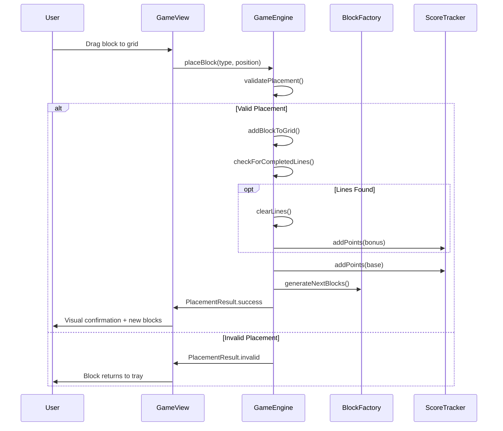
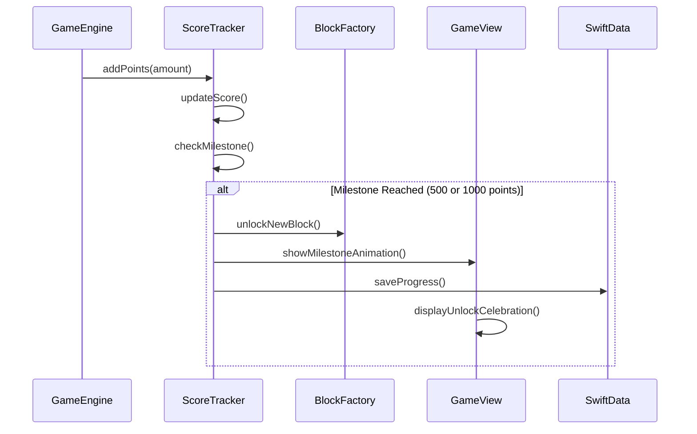
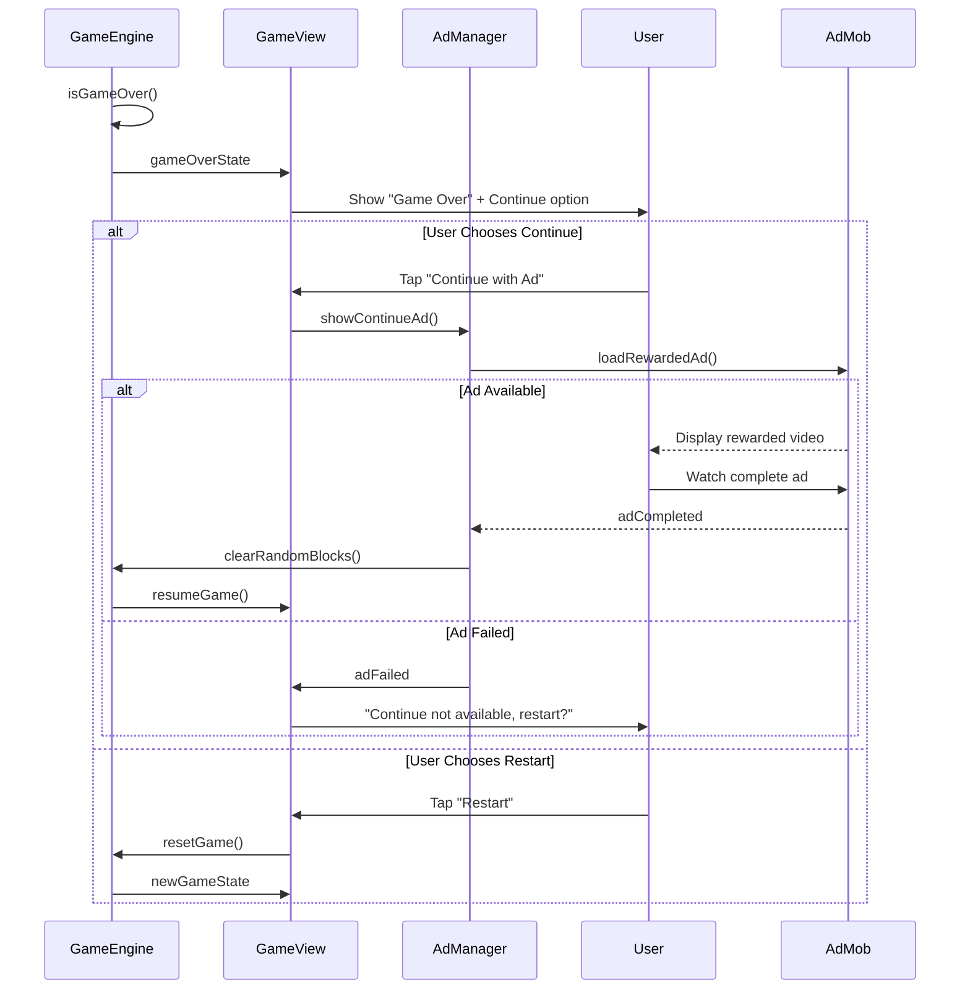

# Core Workflows

Key system workflows using sequence diagrams:

## Block Placement Workflow

```mermaid
sequenceDiagram
    participant User
    participant GameView  
    participant GameEngine
    participant BlockFactory
    participant ScoreTracker
    
    User->>GameView: Drag block to grid
    GameView->>GameEngine: placeBlock(type, position)
    GameEngine->>GameEngine: validatePlacement()
    
    alt Valid Placement
        GameEngine->>GameEngine: addBlockToGrid()
        GameEngine->>GameEngine: checkForCompletedLines()
        
        opt Lines Found
            GameEngine->>GameEngine: clearLines()
            GameEngine->>ScoreTracker: addPoints(bonus)
        end
        
        GameEngine->>ScoreTracker: addPoints(base)
        GameEngine->>BlockFactory: generateNextBlocks()
        GameEngine->>GameView: PlacementResult.success
        GameView->>User: Visual confirmation + new blocks
    else Invalid Placement  
        GameEngine->>GameView: PlacementResult.invalid
        GameView->>User: Block returns to tray
    end
```

## Score Milestone Workflow

```mermaid
sequenceDiagram
    participant GameEngine
    participant ScoreTracker
    participant BlockFactory
    participant GameView
    participant SwiftData
    
    GameEngine->>ScoreTracker: addPoints(amount)
    ScoreTracker->>ScoreTracker: updateScore()
    ScoreTracker->>ScoreTracker: checkMilestone()
    
    alt Milestone Reached (500 or 1000 points)
        ScoreTracker->>BlockFactory: unlockNewBlock()
        ScoreTracker->>GameView: showMilestoneAnimation()
        ScoreTracker->>SwiftData: saveProgress()
        GameView->>GameView: displayUnlockCelebration()
    end
```

## Game Over and Continue Workflow

```mermaid
sequenceDiagram
    participant GameEngine
    participant GameView
    participant AdManager
    participant User
    participant AdMob
    
    GameEngine->>GameEngine: isGameOver()
    GameEngine->>GameView: gameOverState
    GameView->>User: Show "Game Over" + Continue option
    
    alt User Chooses Continue
        User->>GameView: Tap "Continue with Ad"
        GameView->>AdManager: showContinueAd()
        AdManager->>AdMob: loadRewardedAd()
        
        alt Ad Available
            AdMob-->>User: Display rewarded video
            User->>AdMob: Watch complete ad
            AdMob-->>AdManager: adCompleted
            AdManager->>GameEngine: clearRandomBlocks()
            GameEngine->>GameView: resumeGame()
        else Ad Failed
            AdManager->>GameView: adFailed
            GameView->>User: "Continue not available, restart?"
        end
    else User Chooses Restart
        User->>GameView: Tap "Restart"
        GameView->>GameEngine: resetGame()
        GameEngine->>GameView: newGameState
    end
```