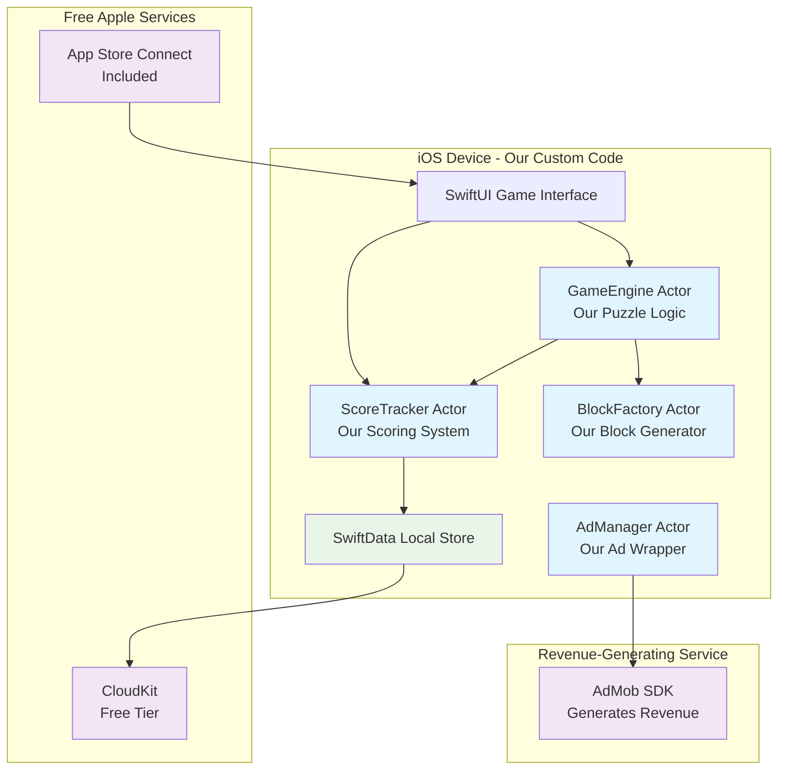

# High Level Architecture

## Technical Summary

Block Puzzle Pro implements a **Native iOS Actor-Based Architecture** deployed as a single app package with integrated cloud services. The system leverages Swift 6.1's enhanced concurrency model to separate game logic into **custom Swift actors we'll develop ourselves** - no external engines or paid services required.

**What These Actors Actually Are (Custom Swift Code):**
- **GameEngine Actor**: Our custom puzzle game logic (grid management, block placement, line clearing)
- **ScoreTracker Actor**: Our custom scoring system (points calculation, milestone tracking, high scores)
- **BlockFactory Actor**: Our custom block generation system (creates L-shapes, squares, etc.)
- **AdManager Actor**: Our custom wrapper around AdMob SDK (handles ad requests, not a paid service)

All actors communicate through Swift's structured concurrency patterns. The architecture achieves PRD performance goals through SpriteKit's optimized rendering pipeline, SwiftData's efficient local persistence with automatic CloudKit synchronization, and strategic AdMob integration that maintains 60fps gameplay while delivering targeted $10K monthly revenue through player-controlled rewarded video ads.

## Platform and Infrastructure Choice

Based on the PRD requirements for rapid solo development and premium iOS gaming experience, I'm recommending the **Apple Native Ecosystem** approach:

**Option 1: Apple Native Ecosystem (RECOMMENDED)**
- **Pros:** Optimal performance, seamless device integration, mature tooling, single developer efficiency
- **Cons:** iOS-only, requires Apple Developer Program, App Store dependency
- **Services:** CloudKit (free with limits), AdMob (revenue generating), App Store Connect (included)

**Option 2: Cross-Platform Game Engine (React Native + Expo)**  
- **Pros:** Potential Android expansion, web deployment options
- **Cons:** Performance limitations for 60fps gaming, complex native module integration
- **Services:** Firebase, AdMob, Expo Application Services

**Option 3: Unity Cross-Platform**
- **Pros:** Professional game engine, multi-platform deployment
- **Cons:** Overkill for 2D puzzle game, steeper learning curve, larger app size
- **Services:** Unity Cloud, Unity Ads, platform-specific stores

**RECOMMENDATION: Apple Native Ecosystem**

**Platform:** iOS Native (Swift 6.1 + SpriteKit)
**Key Services:** CloudKit (free tier), AdMob (generates revenue), App Store Connect (distribution), TestFlight (beta testing)
**Deployment Host and Regions:** App Store Global Distribution, CloudKit automatically handles regional data centers

## Repository Structure

**Structure:** Single iOS Xcode Project (Monolith)
**Monorepo Tool:** N/A - Swift Package Manager for dependency management
**Package Organization:** Actor-based logical separation within single target

```
BlockPuzzlePro/
├── Sources/
│   ├── Actors/           # Our custom game actors
│   ├── Views/            # SwiftUI game interface  
│   ├── Models/           # SwiftData persistence models
│   ├── Services/         # External service integrations
│   └── Utilities/        # Shared utilities and extensions
├── Resources/            # Game assets and configurations
├── Tests/               # Unit and integration tests
└── Package.swift        # Swift Package Manager dependencies
```

## High Level Architecture Diagram



## Architectural Patterns

- **Actor-Based Concurrency:** Our custom isolated game subsystems communicate through Swift's structured concurrency - _Rationale:_ Ensures thread-safe game state management and 60fps performance without traditional locking mechanisms

- **MVVM with SwiftUI:** Model-View-ViewModel pattern with reactive UI updates - _Rationale:_ Native iOS pattern that integrates seamlessly with SwiftData and provides declarative UI that scales across all device sizes

- **Repository Pattern:** SwiftData models with CloudKit synchronization abstracted through repository interfaces - _Rationale:_ Enables clean separation between local persistence and cloud sync, facilitating testing and future data layer changes

- **Observer Pattern:** Score milestones and block unlocks trigger system-wide notifications - _Rationale:_ Decouples game progression logic from UI updates and achievement systems

- **Strategy Pattern:** Different game modes (endless, 3/5/7 minute timers) implement common gameplay interface - _Rationale:_ Enables easy addition of new game modes while maintaining consistent core mechanics
